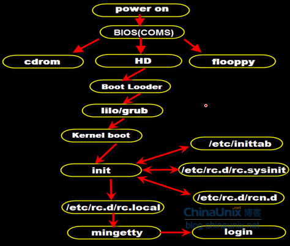

引导流程
===========

1. 加载 BIOS （基本输入输出系统）

    :自检: 检查硬件信息，确定启动设备（出现logo）

#. 读取 **MBR** ，运行系统引导程序

    :Master Boot Record: 主引导记录区，硬盘第 0 磁道第 1 扇区（ **512B** ）

        :Boot Loader: 主引导程序（ **448B** ）

            - 在操作系统内核运行之前运行的一段小程序
                - 初始化硬件设备、建立内存空间的映射图
                - 将系统的软硬件环境带到一个合适的状态
                - 为最终调用操作系统内核准备好环境
            - 提供不同的开机选项菜单
            - 载入内核文件
            - 将引导加载功能转交其他 loader （同时安装多套操作系统）
            - 加载配置档
                - 一般来说都在 /boot 下
                - 透过 boot loader 加载所有配置档与相关的环境参数文件
                    - 包括文件系统定义与主要配置档 menu.lst

            :Grub: Boot Loader 的一种

                :centOS6: ``/boot/grub/grub.conf``

        :Disk Partition table: 硬盘分区表（ **64B** ），记录硬盘分区数以及每一分区大小
        :magic number:         分区有效标志（ **2B** ）

            :0xAA55: 小端模式处理器（如Intel系列）
            :0x55AA: 大端模式处理器（如Motorola6800）

#. 加载 kernel
    :/sbin/init:     kernel 开启进程 0
    :加载服务进程:     进程 0 加载进程 2
    :加载常用程序进程: 进程 0 加载进程 1

#. kernel 执行 init 进程
    1. 依据配置文件来设定 7 个运行等级

        :init 0: 关机
        :init 1: 单用户（root）模式，没有网络
        :init 2: 命令行（没有NFS）
        :init 3: 命令行
        :init 4: 保留
        :init 5: 图形界面
        :init 6: 重启
        :配置文件:

            :centOS7: ``/lib/systemd/system/runlevel*.target``
    #. /etc/rc.d/xx ，设置IP、时间、日期、主机名、挂载
    #. 根据运行级别，运行 /etc/rc.d/rc0.d~rc6.d 中的相应的脚本程序
    #. /etc/rc.d/rc.local ，加载个性化启动项
#. 执行 /bin/login ，进入登录状态

**BIOS与MBR都是硬件本身会支持的功能**

改密码
------

:centOS7:
    - 出现 redhat 选项
        - 按 e ，编辑 grub
            :添加内核参数: ``...UTF-8 rd.break``
        - Ctrl+X
            :查看真正的根目录:      ``ls``
            :重挂载根目录为读写模式: ``mount -o remount,rw /sysroot/``
            :重置 root:           ``chroot /sysroot/``
            :重置密码:             ``passwd root``
            :准备重新打标签:        ``touch /.autorelabel``
            :退出:                ``exit``
            :重启:                ``reboot``
:centOS6:
    - 倒计时
        - 按 e ，进入编辑模式
        - 选 kernel ，按 e ，编辑 grab
            :单用户模式: ``...init=/sbin/init single``
        - 回车返回
        - 按 b 键重启
            :修改密码: ``passwd root``
            :重启:    ``reboot``
